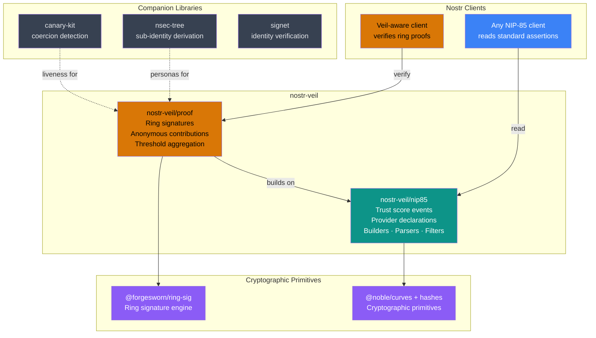

# nostr-veil

[](https://github.com/forgesworn/nostr-veil/actions/workflows/ci.yml)
[](https://www.npmjs.com/package/nostr-veil)
[](./LICENCE)
[](https://github.com/sponsors/TheCryptoDonkey)

**Trust scores you can verify without seeing who contributed them.**

A privacy layer for Nostr reputation systems. A group of people can collectively score someone's trustworthiness, and anyone can verify the result -- but nobody can tell which group members actually contributed. Built for abuse reporting, whistleblowing, journalism, and anonymous peer review.

**New here?** The [**use-case overview**](https://veil.forgesworn.dev/use-cases/) covers what nostr-veil is, the problem it solves, and practical things you can build on it today.

---

## Key concepts

If you're new to this space, here's what the jargon means:

| Term | Plain English |
|------|--------------|
| **Web of Trust (WoT)** | Instead of a central authority deciding who's trustworthy, people vouch for each other. Your reputation is built from the opinions of people who know you. |
| **NIP-85** | A [Nostr standard](https://github.com/nostr-protocol/nips/blob/master/85.md) for publishing trust scores (e.g. "this person has 800 followers and a rank of 74"). Think of it as a shared format for reputation data. |
| **Ring signature** | A cryptographic technique where someone signs a message on behalf of a group. A verifier can confirm "someone in this group signed this" but cannot tell who. Like a sealed ballot -- you can count the votes but not trace them. |
| **LSAG** | Linkable Spontaneous Anonymous Group signature -- a specific type of ring signature that also detects duplicates. If the same person tries to vote twice, the system catches it, without revealing who they are. |
| **Trust circle** | The group of people who collectively produce a trust score. Each member contributes anonymously; the results are combined (median by default). |

---

## The trust trilemma

Today's Nostr trust scores (NIP-85) ask you to pick two:

| Property    | Standard NIP-85 | With nostr-veil |
|-------------|:---:|:---:|
| Verifiable  | ✓   | ✓  |
| Private     | ✗   | ✓  |
| Portable    | ✓   | ✓  |

Anyone who can see an ordinary score can see who published it, and multi-party reputation usually creates a visible contributor graph. That works fine for benign social signals. It fails the moment the subject matter is sensitive -- abuse reporting, whistleblowing, political dissent. The people who need reputation systems most are the ones who cannot afford to be identified.

nostr-veil solves all three for group assertions. The output is a standard NIP-85 event that NIP-85-aware apps can display. Apps that understand nostr-veil can go further and verify the cryptographic proofs that back the scores.

---

## Architecture



---

## Quick start

```
npm install nostr-veil
```

```ts
import { createTrustCircle, contributeAssertion, aggregateContributions, verifyProof } from 'nostr-veil'

// 1. Define the circle (three anonymous members)
const circle = createTrustCircle([alicePubkey, bobPubkey, carolPubkey])

// 2. Each member contributes independently -- their identity is hidden inside the ring
const alice = contributeAssertion(circle, subjectPubkey, { followers: 820, rank: 74 }, alicePrivkey, 0)
const bob   = contributeAssertion(circle, subjectPubkey, { followers: 900, rank: 80 }, bobPrivkey,   1)

// 3. Aggregate into a standard NIP-85 kind 30382 user assertion
const assertion = aggregateContributions(circle, subjectPubkey, [alice, bob])

// 4. Any client verifies -- two distinct members agreed, no names attached
const result = verifyProof(assertion)
// { valid: true, circleSize: 3, threshold: 2, distinctSigners: 2, errors: [] }
```

**Important:** `memberIndex` must match the member's position in the *sorted* pubkey array. `createTrustCircle` sorts pubkeys lexicographically -- the index you pass to `contributeAssertion` must reflect that sorted order, not the order you passed to `createTrustCircle`. Use `circle.members.indexOf(myPubkey)` to find the correct index.

The resulting `assertion` is a plain `EventTemplate` you sign and publish like any other Nostr event.

---

## API reference

### `nostr-veil/nip85` -- NIP-85 foundation

| Export | Description |
|--------|-------------|
| `buildUserAssertion(pubkey, metrics)` | Build a NIP-85 kind 30382 user assertion event template |
| `buildEventAssertion(eventId, metrics)` | Build a NIP-85 kind 30383 event assertion |
| `buildAddressableAssertion(address, metrics)` | Build a NIP-85 kind 30384 addressable event assertion |
| `buildIdentifierAssertion(identifier, kTag, metrics)` | Build a NIP-85 kind 30385 NIP-73/external identifier assertion |
| `buildProviderDeclaration(providers, encryptedContent?)` | Build a NIP-85 kind 10040 trusted service provider declaration |
| `parseAssertion(event)` | Parse a raw event into a `ParsedAssertion` |
| `parseProviderDeclaration(event, decryptFn?)` | Parse a kind 10040 provider declaration into `ParsedProvider[]` (supports optional NIP-44 decryption) |
| `validateAssertion(event, options?)` | Validate a NIP-85 assertion -- pass `{ strict: true }` for kind-specific metric checks and optional subject-hint validation |
| `validateAssertionStrict(event)` | Strict NIP-85 assertion validation shortcut |
| `validateProviderDeclarationStrict(event)` | Strict kind 10040 provider declaration validation for plaintext tags; encrypted declarations are accepted when tags are omitted |
| `assertionFilter({ kind, subject?, provider? })` | Build a relay query filter for assertions |
| `providerFilter(pubkey)` | Build a relay query filter for a provider declaration |
| `NIP85_KINDS`, `describeNip85Kind(kind)` | Kind constants and labels for the [NIP-85](https://nips.nostr.com/85) trusted assertion kinds |

### `nostr-veil/proof` -- Ring-signature proof layer

| Export | Description |
|--------|-------------|
| `createTrustCircle(memberPubkeys, options?)` | Create a trust circle from an array of pubkeys; pass `{ scope }` to federate circles for [cross-circle deduplication](#cross-circle-deduplication) |
| `contributeAssertion(circle, subject, metrics, privateKey, memberIndex, options?)` | Produce an anonymous ring-signed `Contribution`; v1 by default, v2 when `{ proofVersion: 'v2', kind, subjectTag, subjectTagValue }` is supplied |
| `contributeEventAssertion(circle, eventId, metrics, privateKey, memberIndex, options?)` | Produce a contribution for a kind 30383 event assertion |
| `contributeAddressableAssertion(circle, address, metrics, privateKey, memberIndex, options?)` | Produce a contribution for a kind 30384 addressable assertion |
| `contributeIdentifierAssertion(circle, identifier, kTag, metrics, privateKey, memberIndex, options?)` | Produce a contribution for a kind 30385 identifier assertion |
| `aggregateContributions(circle, subject, contributions, options?)` | Aggregate user-score contributions into a kind 30382 NIP-85 event with veil tags (default aggregation: median) |
| `aggregateEventContributions(circle, eventId, contributions, options?)` | Aggregate into a kind 30383 event assertion with `d`/`e` tags |
| `aggregateAddressableContributions(circle, address, contributions, options?)` | Aggregate into a kind 30384 addressable assertion with `d`/`a` tags |
| `aggregateIdentifierContributions(circle, identifier, kTag, contributions, options?)` | Aggregate into a kind 30385 identifier assertion with `d`/`k` tags |
| `verifyProof(event, options?)` | Verify ring signatures, threshold metadata, signed metric aggregation, and optional proof-version requirements |
| `verifyFederation(events, options?)` | Verify several scoped events together and count distinct contributors across circles ([cross-circle deduplication](#cross-circle-deduplication)) |
| `canonicalMessage(circleId, subject, metrics)` | Compute the canonical message signed by contributors |
| `canonicalMessageV2(circleId, subject, metrics, context)` | Compute the opt-in v2 canonical message that binds kind and subject hint tag |
| `computeCircleId(sortedPubkeys)` | Compute the deterministic circle ID (SHA-256 of colon-joined pubkeys) |

### `nostr-veil/profiles` -- safer deployment profiles

| Export | Description |
|--------|-------------|
| `USE_CASE_PROFILES` | Built-in machine-readable profiles for the documented use cases |
| `USE_CASE_PROFILE_BY_ID` | Lookup table keyed by use-case slug |
| `verifyUseCaseProfile(events, profile, options)` | Verify NIP-85 syntax, proof v2, subject binding, threshold, freshness, accepted circles, and federation policy |
| `createCircleManifest(options)` | Build a machine-readable circle manifest with member list, allowed profiles, expiry, revocation, and supersession metadata |
| `verifyCircleManifest(manifest, options?)` | Verify that a circle manifest matches its members and deployment constraints |
| `createDeploymentPolicy(profile, options)` | Build a fail-closed deployment policy with accepted circles, expected subject, metric bounds, freshness, threshold, and signature requirements |
| `verifyDeploymentPolicy(events, policy, options?)` | Verify a profile plus deployment-specific controls before acting on a score |
| `createSignedDeploymentBundle(policy, options)` | Sign a deployment policy and its manifests as trusted operator configuration |
| `verifyDeploymentBundle(events, bundle, options?)` | Verify a signed bundle from trusted publishers, then verify the bundled deployment policy |
| `canonicalRelaySubject`, `canonicalNip05Subject`, `canonicalDomainSubject`, `canonicalNpmPackageSubject` | Canonical subject helpers for common real-world identifiers |
| `canonicalPubkeySubject`, `canonicalEventSubject`, `canonicalAddressSubject` | Canonical subject helpers for Nostr-native subjects |

### Signing utility (root export)

| Export | Description |
|--------|-------------|
| `signEvent(template, privateKey)` | Sign an unsigned event template with BIP-340 Schnorr -- returns a complete `SignedEvent` |
| `verifySignedEvent(event)` | Verify a signed Nostr event id and BIP-340 signature after fetching from an untrusted relay |
| `computeEventId(event)` | Compute the NIP-01 event ID (SHA-256 of canonical serialisation) |

---

## How it works

Each member of a trust circle independently submits their scores. Under the hood, each submission is wrapped in a ring signature -- a cryptographic envelope that proves "a member of this group signed this" without revealing which member.

The published event carries extra tags on top of the standard NIP-85 format:

- `veil-ring` -- the full list of circle members (the group who could have contributed)
- `veil-threshold` -- how many members actually contributed vs. total circle size
- `veil-agg` -- which aggregate function produced the metric tags (median by default)
- `veil-sig` (one per contributor) -- the ring signature and a duplicate-detection token
- `veil-version` -- present only for opt-in proof v2 events
- `veil-scope` -- present only for a federated circle; see [Cross-circle deduplication](#cross-circle-deduplication)

A verifier calls `verifyProof`, which:

1. Checks each ring signature is valid (a real member signed it)
2. Checks the duplicate-detection tokens are all different (nobody voted twice)
3. Confirms the threshold metadata matches the ring and distinct signatures
4. Confirms the published metric tags match the aggregate of the signed contributions

At no point does verification require knowing which member produced which signature. The group membership is public. The identities of the actual contributors are not. The signed metric values are public inside the proof, so nostr-veil hides contributor identity, not the fact that an anonymous contributor submitted a particular score.

By default, verification expects the same median aggregation used by `aggregateContributions`. If you pass a custom `aggregateFn` to `aggregateContributions`, pass the same function to `verifyProof`.

### Proof v2

The original proof format remains the default. It signs the circle ID, the `d`-tag subject, and numeric metrics, and it uses `veil:v1:<scope-or-circleId>:<subject>` as the LSAG election ID.

Proof v2 is additive and opt-in. It signs the same data plus the NIP-85 assertion kind and the subject hint tag/value (`p`, `e`, `a`, or `k`), and derives the key image from that semantic context. That prevents a valid contribution for one assertion class being replayed as another when a subject string is reused.

```ts
import { contributeEventAssertion, aggregateEventContributions, verifyProof } from 'nostr-veil'

const contribution = contributeEventAssertion(
  circle,
  eventId,
  { rank: 90 },
  alicePrivkey,
  circle.members.indexOf(alicePubkey),
  { proofVersion: 'v2' },
)

const assertion = aggregateEventContributions(circle, eventId, [contribution], { proofVersion: 'v2' })
const result = verifyProof(assertion, { requireProofVersion: 'v2' })
```

Old v1 events still verify without changes. Use `requireProofVersion: 'v2'` only when your application policy wants to reject legacy proofs for that workflow.

---

## Threat model

nostr-veil is a privacy layer for already-defined trust circles. It gives you:

- Anonymous membership proof: each contribution was signed by some member of the public ring, without revealing which member.
- Duplicate detection: one member cannot contribute twice within the same circle/scope and subject without reusing the same LSAG key image.
- Signed metric integrity: `verifyProof` checks the published metric tags against the aggregate of the signed contribution messages.
- Optional semantic binding: proof v2 binds the assertion kind and subject hint tag into the signed message and election ID.
- Standard NIP-85 output: non-veil clients can still read the aggregate score.

The boundary is deliberately narrow. Pair each limitation with the right
application control:

- The ring membership list is public; use a cover set large enough for the risk
  and avoid circles that reveal vulnerable participants by membership alone.
- Anonymous metric values are public so anyone can recompute the aggregate;
  publish only metrics your workflow is comfortable exposing.
- Network, timing, relay, and collector metadata are outside the proof; use
  batching, transport privacy, and careful logging for sensitive collection.
- Circle quality is social policy; publish admission, rotation, Sybil, and
  conflict rules for circles that drive real decisions.
- A shared federation `scope` intentionally reveals cross-circle overlap by key
  image; use scoped federation only when deduplication is worth that signal.

For sensitive deployments, combine nostr-veil with careful collection,
transport privacy, key hygiene, and a clear policy for how circles are admitted
and rotated.

---

## Use cases

The shipped primitives support more than user trust scores. See
[docs/use-cases.md](./docs/use-cases.md) for the implementation field guide:
one worked page per use case, subject formats, helper functions, metrics,
proof-v2 verification, and the operational controls needed beyond the proof.

Supported today:

- User reputation and abuse reporting with NIP-85 kind 30382 user assertions.
- Source corroboration and peer review, using NIP-85 kind 30382 for pubkeys or kind 30385 for NIP-73/external identifiers.
- Event and claim verification with NIP-85 kind 30383 event assertions via `aggregateEventContributions`.
- Article, long-form note, research, grant, and proposal review with NIP-85 kind 30384 addressable event assertions via `aggregateAddressableContributions`.
- Relay, service, vendor, marketplace, package, release, maintainer, NIP-05, and domain reputation with NIP-85 kind 30385 identifier assertions via `aggregateIdentifierContributions`.
- Community list, labeler, and moderation-list reputation where users can compare curation sources without mapping every reviewer.
- Federated moderation where scoped circles count overlapping contributors once, not once per circle.
- Privacy-preserving onboarding where an already-trusted circle can vouch for a new account without naming the individual vouchees.

Future profiles:

- Anonymous credential or attestation co-signing, once endorsement event formats define subject, expiry, revocation, and presentation rules.
- Relay or community admission, once a gated-access handshake exists; today nostr-veil can publish the threshold-backed assertion, but it is not the whole anonymous access-control protocol.

nostr-veil proves that distinct keys from a public trust circle contributed. Trust-circle formation, Sybil policy, revocation, and anonymous access control are separate application-layer decisions.

---

## Cross-circle deduplication

By default every trust circle is cryptographically isolated. A contributor's duplicate-detection token -- the LSAG key image -- is derived from the circle itself, so the same person contributing to two different circles produces two unrelated tokens. Nobody can tell the circles share a member.

That isolation is the right default, but it caps a trust score at one circle. To count honestly across a *federation* of circles all assessing the same subject, give them a shared `scope`:

```ts
// Two community moderation circles, one federation
const circleA = createTrustCircle(membersA, { scope: 'community-moderators' })
const circleB = createTrustCircle(membersB, { scope: 'community-moderators' })
```

Scopes are lowercase slugs: letters, digits, dot, hyphen, and underscore.

Circles sharing a `scope` derive the key image from the scope rather than the circle, so a contributor who appears in several of them produces the *same* token in each. `verifyFederation` gathers events from across the federation, verifies each one, and counts the distinct contributors -- matched by key image, never by identity:

```ts
import { verifyFederation } from 'nostr-veil'

// Aggregated events from every circle in the federation, all about the same subject
const result = verifyFederation([circleAEvent, circleBEvent, circleCEvent])
// { valid: true, scope: 'community-moderators', circleCount: 3,
//   totalSignatures: 7, distinctSigners: 5, ... }
// distinctSigners < totalSignatures: two contributors signed in more than one circle
```

A scoped event carries a `veil-scope` tag, which both `verifyProof` and `verifyFederation` read automatically. `verifyFederation` rejects the federation if the events disagree on subject or scope, or if any event is unscoped -- an isolated circle's key images cannot be matched across circles. Circles created without a `scope` behave exactly as before: no tag, fully isolated.

**Trade-off.** A shared scope is what enables cross-circle counting, and equally what makes cross-circle membership *overlap* observable: anyone collecting the events can see that one contributor signed in several circles, still without learning who. Use a `scope` when federated counting is worth that signal, and omit it otherwise.

---

## Companion projects

nostr-veil is one layer of a broader identity and trust stack:

- [@forgesworn/ring-sig](https://github.com/forgesworn/ring-sig) -- The ring signature engine (the core cryptography)
- [nsec-tree](https://github.com/forgesworn/nsec-tree) -- Generate separate anonymous identities from a single master key
- [canary-kit](https://github.com/forgesworn/canary-kit) -- Detect when someone is being coerced (duress signals)
- [signet](https://github.com/forgesworn/signet) -- Decentralised identity verification for Nostr
- [dominion](https://github.com/forgesworn/dominion) -- Epoch-based encrypted content access control

Each project is independently maintained and published. nostr-veil focuses solely on anonymous trust assertions.

---

## Further reading

- [IMPACT.md](./IMPACT.md) -- Problem statement and ecosystem impact
- [docs/use-cases.md](./docs/use-cases.md) -- Concrete implementation map with individual worked use-case pages
- [CONTRIBUTING.md](./CONTRIBUTING.md) -- Setup, testing, and PR guidelines
- [SECURITY.md](./SECURITY.md) -- Vulnerability reporting and cryptographic scope
- [llms.txt](./llms.txt) -- Machine-readable project summary for LLMs
- [CLAUDE.md](./CLAUDE.md) -- AI agent instructions for contributing

## Part of the ForgeSworn Toolkit

[ForgeSworn](https://forgesworn.dev) builds open-source cryptographic identity, payments, and coordination tools for Nostr.

| Library | What it does |
|---------|-------------|
| [nsec-tree](https://github.com/forgesworn/nsec-tree) | Deterministic sub-identity derivation |
| [ring-sig](https://github.com/forgesworn/ring-sig) | Ring signature engine (core cryptography) |
| [range-proof](https://github.com/forgesworn/range-proof) | Pedersen commitment range proofs |
| [canary-kit](https://github.com/forgesworn/canary-kit) | Coercion-resistant spoken verification |
| [spoken-token](https://github.com/forgesworn/spoken-token) | Human-speakable verification tokens |
| [toll-booth](https://github.com/forgesworn/toll-booth) | L402 payment middleware |
| [geohash-kit](https://github.com/forgesworn/geohash-kit) | Geohash toolkit with polygon coverage |
| [nostr-attestations](https://github.com/forgesworn/nostr-attestations) | NIP-VA verifiable attestations |
| [dominion](https://github.com/forgesworn/dominion) | Epoch-based encrypted access control |
| [nostr-veil](https://github.com/forgesworn/nostr-veil) | Privacy-preserving Web of Trust |

## Licence

MIT
