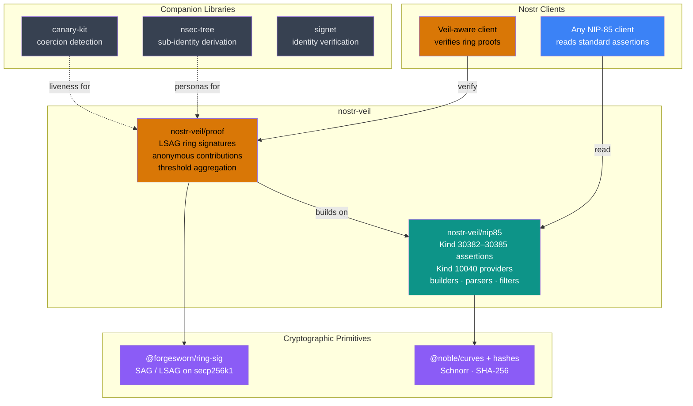

# nostr-veil

[](https://github.com/forgesworn/nostr-veil/actions/workflows/ci.yml)
[](https://www.npmjs.com/package/nostr-veil)
[](./LICENCE)

**Trust scores you can verify without seeing who contributed them.**

Anonymous trust assertions for Nostr. LSAG ring signatures over NIP-85 events so endorsements are verifiable but contributors are unidentifiable.

**Who is this for?** Nostr client developers building trust systems where contributor privacy matters -- abuse reporting, whistleblowing, journalism, anonymous peer review. If your users can't afford to be identified when vouching for someone, this is the library.

---

## The Trust Trilemma

Today's NIP-85 trust scores ask you to pick two:

| Property    | NIP-85 today | nostr-veil |
|-------------|:---:|:---:|
| Verifiable  | ✓   | ✓  |
| Private     | ✗   | ✓  |
| Portable    | ✓   | ✓  |

Anyone who can see the assertions can see exactly who judged you. That works fine for benign social signals. It fails completely the moment the subject matter is sensitive -- abuse reporting, whistleblowing, political dissent. The people who need Web of Trust most are the ones who cannot afford to be identified.

nostr-veil solves all three. Assertions are standard NIP-85 events that any existing client can consume. Veil-aware clients can go further and verify the cryptographic proofs that back them.

---

## Architecture



---

## Quick start

```
npm install nostr-veil
```

```ts
import { createTrustCircle, contributeAssertion, aggregateContributions, verifyProof } from 'nostr-veil'

// 1. Define the circle (three anonymous members)
const circle = createTrustCircle([alicePubkey, bobPubkey, carolPubkey])

// 2. Each member contributes independently -- their identity is hidden inside the ring
const alice = contributeAssertion(circle, subjectPubkey, { followers: 820, rank: 74 }, alicePrivkey, 0)
const bob   = contributeAssertion(circle, subjectPubkey, { followers: 900, rank: 80 }, bobPrivkey,   1)

// 3. Aggregate into a standard NIP-85 kind 30382 event
const assertion = aggregateContributions(circle, subjectPubkey, [alice, bob])

// 4. Any client verifies -- two distinct members agreed, no names attached
const result = verifyProof(assertion)
// { valid: true, circleSize: 3, threshold: 2, distinctSigners: 2, errors: [] }
```

**Important:** `memberIndex` must match the member's position in the *sorted* pubkey array. `createTrustCircle` sorts pubkeys lexicographically -- the index you pass to `contributeAssertion` must reflect that sorted order, not the order you passed to `createTrustCircle`. Use `circle.members.indexOf(myPubkey)` to find the correct index.

The resulting `assertion` is a plain `EventTemplate` you sign and publish like any other Nostr event.

---

## API reference

### `nostr-veil/nip85` -- NIP-85 foundation

| Export | Description |
|--------|-------------|
| `buildUserAssertion(pubkey, metrics)` | Build a kind 30382 user assertion event template |
| `buildEventAssertion(eventId, metrics)` | Build a kind 30383 event assertion |
| `buildAddressableAssertion(address, metrics)` | Build a kind 30384 addressable assertion |
| `buildIdentifierAssertion(identifier, kTag, metrics)` | Build a kind 30385 identifier assertion |
| `buildProviderDeclaration(providers, encryptedContent?)` | Build a kind 10040 provider declaration |
| `parseAssertion(event)` | Parse a raw event into a `ParsedAssertion` |
| `parseProviderDeclaration(event, decryptFn?)` | Parse a kind 10040 provider declaration into `ParsedProvider[]` (supports optional NIP-44 decryption) |
| `validateAssertion(event)` | Validate a NIP-85 assertion -- returns `{ valid, errors }` |
| `assertionFilter({ kind, subject?, provider? })` | Build a relay query filter for assertions |
| `providerFilter(pubkey)` | Build a relay query filter for a provider declaration |
| `NIP85_KINDS` | Kind constants: `USER`, `EVENT`, `ADDRESSABLE`, `IDENTIFIER`, `PROVIDER` |

### `nostr-veil/proof` -- Ring-signature proof layer

| Export | Description |
|--------|-------------|
| `createTrustCircle(memberPubkeys)` | Create a trust circle from an array of pubkeys |
| `contributeAssertion(circle, subject, metrics, privateKey, memberIndex)` | Produce an anonymous `Contribution` using LSAG |
| `aggregateContributions(circle, subject, contributions, options?)` | Aggregate contributions into a NIP-85 event with veil tags (default aggregation: median) |
| `verifyProof(event)` | Verify all LSAG signatures and return a `ProofVerification` |
| `canonicalMessage(circleId, subject, metrics)` | Compute the canonical message signed by contributors |
| `computeCircleId(sortedPubkeys)` | Compute the deterministic circle ID (SHA-256 of colon-joined pubkeys) |

### Signing utility (root export)

| Export | Description |
|--------|-------------|
| `signEvent(template, privateKey)` | Sign an unsigned event template with BIP-340 Schnorr -- returns a complete `SignedEvent` |
| `computeEventId(event)` | Compute the NIP-01 event ID (SHA-256 of canonical serialisation) |

---

## How it works

Each member of a trust circle calls `contributeAssertion` independently. Under the hood this calls `lsagSign` from `@forgesworn/ring-sig`, which produces a Linkable Spontaneous Anonymous Group signature over the canonical message `{ circleId, subject, metrics }`.

The published NIP-85 event carries three extra tags:

- `veil-ring` -- the full set of member pubkeys (the ring)
- `veil-threshold` -- how many contributions were aggregated out of how many members
- `veil-sig` (one per contribution) -- the serialised LSAG signature and key image

A verifier calls `verifyProof`, which:

1. Reconstructs each LSAG signature against the ring
2. Confirms each signature is valid
3. Checks key images are distinct -- proving each signer contributed at most once (LSAG linkability property)
4. Confirms the number of valid, distinct signatures meets the threshold

At no point does verification require knowing which member produced which signature. The ring is public. The identities of the actual signers are not.

---

## Companion projects

nostr-veil is one layer of a broader identity and trust stack:

- [@forgesworn/ring-sig](https://github.com/forgesworn/ring-sig) -- LSAG ring signatures on secp256k1 (the cryptographic primitive)
- [nsec-tree](https://github.com/forgesworn/nsec-tree) -- Deterministic sub-identity derivation (compartmentalised personas for trust circles)
- [canary-kit](https://github.com/forgesworn/canary-kit) -- Coercion-resistant verification and duress detection
- [signet](https://github.com/forgesworn/signet) -- Decentralised identity verification for Nostr
- [dominion](https://github.com/forgesworn/dominion) -- Epoch-based encrypted content access control

Each project is independently maintained and published. nostr-veil focuses solely on anonymous trust assertions.

---

## Further reading

- [IMPACT.md](./IMPACT.md) -- Problem statement and ecosystem impact
- [CONTRIBUTING.md](./CONTRIBUTING.md) -- Setup, testing, and PR guidelines
- [SECURITY.md](./SECURITY.md) -- Vulnerability reporting and cryptographic scope
- [llms.txt](./llms.txt) -- Machine-readable project summary for LLMs
- [CLAUDE.md](./CLAUDE.md) -- AI agent instructions for contributing

## Part of the ForgeSworn Toolkit

[ForgeSworn](https://forgesworn.dev) builds open-source cryptographic identity, payments, and coordination tools for Nostr.

| Library | What it does |
|---------|-------------|
| [nsec-tree](https://github.com/forgesworn/nsec-tree) | Deterministic sub-identity derivation |
| [ring-sig](https://github.com/forgesworn/ring-sig) | SAG/LSAG ring signatures on secp256k1 |
| [range-proof](https://github.com/forgesworn/range-proof) | Pedersen commitment range proofs |
| [canary-kit](https://github.com/forgesworn/canary-kit) | Coercion-resistant spoken verification |
| [spoken-token](https://github.com/forgesworn/spoken-token) | Human-speakable verification tokens |
| [toll-booth](https://github.com/forgesworn/toll-booth) | L402 payment middleware |
| [geohash-kit](https://github.com/forgesworn/geohash-kit) | Geohash toolkit with polygon coverage |
| [nostr-attestations](https://github.com/forgesworn/nostr-attestations) | NIP-VA verifiable attestations |
| [dominion](https://github.com/forgesworn/dominion) | Epoch-based encrypted access control |
| [nostr-veil](https://github.com/forgesworn/nostr-veil) | Privacy-preserving Web of Trust |

## Licence

MIT
