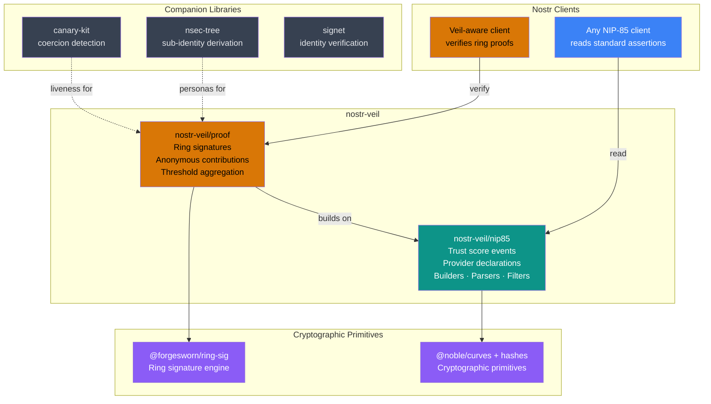

# nostr-veil

[](https://github.com/forgesworn/nostr-veil/actions/workflows/ci.yml)
[](https://www.npmjs.com/package/nostr-veil)
[](./LICENCE)
[](https://github.com/sponsors/TheCryptoDonkey)

**Trust scores you can verify without seeing who contributed them.**

A privacy layer for Nostr reputation systems. A group of people can collectively score someone's trustworthiness, and anyone can verify the result -- but nobody can tell which group members actually contributed. Built for abuse reporting, whistleblowing, journalism, and anonymous peer review.

---

## Key concepts

If you're new to this space, here's what the jargon means:

| Term | Plain English |
|------|--------------|
| **Web of Trust (WoT)** | Instead of a central authority deciding who's trustworthy, people vouch for each other. Your reputation is built from the opinions of people who know you. |
| **NIP-85** | A [Nostr standard](https://github.com/nostr-protocol/nips/blob/master/85.md) for publishing trust scores (e.g. "this person has 800 followers and a rank of 74"). Think of it as a shared format for reputation data. |
| **Ring signature** | A cryptographic technique where someone signs a message on behalf of a group. A verifier can confirm "someone in this group signed this" but cannot tell who. Like a sealed ballot -- you can count the votes but not trace them. |
| **LSAG** | Linkable Spontaneous Anonymous Group signature -- a specific type of ring signature that also detects duplicates. If the same person tries to vote twice, the system catches it, without revealing who they are. |
| **Trust circle** | The group of people who collectively produce a trust score. Each member contributes anonymously; the results are combined (median by default). |

---

## The trust trilemma

Today's Nostr trust scores (NIP-85) ask you to pick two:

| Property    | Standard NIP-85 | With nostr-veil |
|-------------|:---:|:---:|
| Verifiable  | ✓   | ✓  |
| Private     | ✗   | ✓  |
| Portable    | ✓   | ✓  |

Anyone who can see the scores can see exactly who gave them. That works fine for benign social signals. It fails completely the moment the subject matter is sensitive -- abuse reporting, whistleblowing, political dissent. The people who need reputation systems most are the ones who cannot afford to be identified.

nostr-veil solves all three. The output is a standard NIP-85 event that any existing Nostr app can display. Apps that understand nostr-veil can go further and verify the cryptographic proofs that back the scores.

---

## Architecture



---

## Quick start

```
npm install nostr-veil
```

```ts
import { createTrustCircle, contributeAssertion, aggregateContributions, verifyProof } from 'nostr-veil'

// 1. Define the circle (three anonymous members)
const circle = createTrustCircle([alicePubkey, bobPubkey, carolPubkey])

// 2. Each member contributes independently -- their identity is hidden inside the ring
const alice = contributeAssertion(circle, subjectPubkey, { followers: 820, rank: 74 }, alicePrivkey, 0)
const bob   = contributeAssertion(circle, subjectPubkey, { followers: 900, rank: 80 }, bobPrivkey,   1)

// 3. Aggregate into a standard NIP-85 kind 30382 event
const assertion = aggregateContributions(circle, subjectPubkey, [alice, bob])

// 4. Any client verifies -- two distinct members agreed, no names attached
const result = verifyProof(assertion)
// { valid: true, circleSize: 3, threshold: 2, distinctSigners: 2, errors: [] }
```

**Important:** `memberIndex` must match the member's position in the *sorted* pubkey array. `createTrustCircle` sorts pubkeys lexicographically -- the index you pass to `contributeAssertion` must reflect that sorted order, not the order you passed to `createTrustCircle`. Use `circle.members.indexOf(myPubkey)` to find the correct index.

The resulting `assertion` is a plain `EventTemplate` you sign and publish like any other Nostr event.

---

## API reference

### `nostr-veil/nip85` -- NIP-85 foundation

| Export | Description |
|--------|-------------|
| `buildUserAssertion(pubkey, metrics)` | Build a kind 30382 user assertion event template |
| `buildEventAssertion(eventId, metrics)` | Build a kind 30383 event assertion |
| `buildAddressableAssertion(address, metrics)` | Build a kind 30384 addressable assertion |
| `buildIdentifierAssertion(identifier, kTag, metrics)` | Build a kind 30385 identifier assertion |
| `buildProviderDeclaration(providers, encryptedContent?)` | Build a kind 10040 provider declaration |
| `parseAssertion(event)` | Parse a raw event into a `ParsedAssertion` |
| `parseProviderDeclaration(event, decryptFn?)` | Parse a kind 10040 provider declaration into `ParsedProvider[]` (supports optional NIP-44 decryption) |
| `validateAssertion(event)` | Validate a NIP-85 assertion -- returns `{ valid, errors }` |
| `assertionFilter({ kind, subject?, provider? })` | Build a relay query filter for assertions |
| `providerFilter(pubkey)` | Build a relay query filter for a provider declaration |
| `NIP85_KINDS` | Kind constants: `USER`, `EVENT`, `ADDRESSABLE`, `IDENTIFIER`, `PROVIDER` |

### `nostr-veil/proof` -- Ring-signature proof layer

| Export | Description |
|--------|-------------|
| `createTrustCircle(memberPubkeys, options?)` | Create a trust circle from an array of pubkeys; pass `{ scope }` to federate circles for [cross-circle deduplication](#cross-circle-deduplication) |
| `contributeAssertion(circle, subject, metrics, privateKey, memberIndex)` | Produce an anonymous ring-signed `Contribution` |
| `aggregateContributions(circle, subject, contributions, options?)` | Aggregate contributions into a NIP-85 event with veil tags (default aggregation: median) |
| `verifyProof(event, options?)` | Verify ring signatures, threshold metadata, and signed metric aggregation |
| `verifyFederation(events, options?)` | Verify several scoped events together and count distinct contributors across circles ([cross-circle deduplication](#cross-circle-deduplication)) |
| `canonicalMessage(circleId, subject, metrics)` | Compute the canonical message signed by contributors |
| `computeCircleId(sortedPubkeys)` | Compute the deterministic circle ID (SHA-256 of colon-joined pubkeys) |

### Signing utility (root export)

| Export | Description |
|--------|-------------|
| `signEvent(template, privateKey)` | Sign an unsigned event template with BIP-340 Schnorr -- returns a complete `SignedEvent` |
| `computeEventId(event)` | Compute the NIP-01 event ID (SHA-256 of canonical serialisation) |

---

## How it works

Each member of a trust circle independently submits their scores. Under the hood, each submission is wrapped in a ring signature -- a cryptographic envelope that proves "a member of this group signed this" without revealing which member.

The published event carries extra tags on top of the standard NIP-85 format:

- `veil-ring` -- the full list of circle members (the group who could have contributed)
- `veil-threshold` -- how many members actually contributed vs. total circle size
- `veil-agg` -- which aggregate function produced the metric tags (median by default)
- `veil-sig` (one per contributor) -- the ring signature and a duplicate-detection token
- `veil-scope` -- present only for a federated circle; see [Cross-circle deduplication](#cross-circle-deduplication)

A verifier calls `verifyProof`, which:

1. Checks each ring signature is valid (a real member signed it)
2. Checks the duplicate-detection tokens are all different (nobody voted twice)
3. Confirms the threshold metadata matches the ring and distinct signatures
4. Confirms the published metric tags match the aggregate of the signed contributions

At no point does verification require knowing which member produced which signature. The group membership is public. The identities of the actual contributors are not.

By default, verification expects the same median aggregation used by `aggregateContributions`. If you pass a custom `aggregateFn` to `aggregateContributions`, pass the same function to `verifyProof`.

---

## Cross-circle deduplication

By default every trust circle is cryptographically isolated. A contributor's duplicate-detection token -- the LSAG key image -- is derived from the circle itself, so the same person contributing to two different circles produces two unrelated tokens. Nobody can tell the circles share a member.

That isolation is the right default, but it caps a trust score at one circle. To count honestly across a *federation* of circles all assessing the same subject, give them a shared `scope`:

```ts
// Two community moderation circles, one federation
const circleA = createTrustCircle(membersA, { scope: 'community-moderators' })
const circleB = createTrustCircle(membersB, { scope: 'community-moderators' })
```

Circles sharing a `scope` derive the key image from the scope rather than the circle, so a contributor who appears in several of them produces the *same* token in each. `verifyFederation` gathers events from across the federation, verifies each one, and counts the distinct contributors -- matched by key image, never by identity:

```ts
import { verifyFederation } from 'nostr-veil'

// Aggregated events from every circle in the federation, all about the same subject
const result = verifyFederation([circleAEvent, circleBEvent, circleCEvent])
// { valid: true, scope: 'community-moderators', circleCount: 3,
//   totalSignatures: 7, distinctSigners: 5, ... }
// distinctSigners < totalSignatures: two contributors signed in more than one circle
```

A scoped event carries a `veil-scope` tag, which both `verifyProof` and `verifyFederation` read automatically. `verifyFederation` rejects the federation if the events disagree on subject or scope, or if any event is unscoped -- an isolated circle's key images cannot be matched across circles. Circles created without a `scope` behave exactly as before: no tag, fully isolated.

**Trade-off.** A shared scope is what enables cross-circle counting, and equally what makes cross-circle membership *overlap* observable: anyone collecting the events can see that one contributor signed in several circles, still without learning who. Use a `scope` when federated counting is worth that signal, and omit it otherwise.

---

## Companion projects

nostr-veil is one layer of a broader identity and trust stack:

- [@forgesworn/ring-sig](https://github.com/forgesworn/ring-sig) -- The ring signature engine (the core cryptography)
- [nsec-tree](https://github.com/forgesworn/nsec-tree) -- Generate separate anonymous identities from a single master key
- [canary-kit](https://github.com/forgesworn/canary-kit) -- Detect when someone is being coerced (duress signals)
- [signet](https://github.com/forgesworn/signet) -- Decentralised identity verification for Nostr
- [dominion](https://github.com/forgesworn/dominion) -- Epoch-based encrypted content access control

Each project is independently maintained and published. nostr-veil focuses solely on anonymous trust assertions.

---

## Further reading

- [IMPACT.md](./IMPACT.md) -- Problem statement and ecosystem impact
- [CONTRIBUTING.md](./CONTRIBUTING.md) -- Setup, testing, and PR guidelines
- [SECURITY.md](./SECURITY.md) -- Vulnerability reporting and cryptographic scope
- [llms.txt](./llms.txt) -- Machine-readable project summary for LLMs
- [CLAUDE.md](./CLAUDE.md) -- AI agent instructions for contributing

## Part of the ForgeSworn Toolkit

[ForgeSworn](https://forgesworn.dev) builds open-source cryptographic identity, payments, and coordination tools for Nostr.

| Library | What it does |
|---------|-------------|
| [nsec-tree](https://github.com/forgesworn/nsec-tree) | Deterministic sub-identity derivation |
| [ring-sig](https://github.com/forgesworn/ring-sig) | Ring signature engine (core cryptography) |
| [range-proof](https://github.com/forgesworn/range-proof) | Pedersen commitment range proofs |
| [canary-kit](https://github.com/forgesworn/canary-kit) | Coercion-resistant spoken verification |
| [spoken-token](https://github.com/forgesworn/spoken-token) | Human-speakable verification tokens |
| [toll-booth](https://github.com/forgesworn/toll-booth) | L402 payment middleware |
| [geohash-kit](https://github.com/forgesworn/geohash-kit) | Geohash toolkit with polygon coverage |
| [nostr-attestations](https://github.com/forgesworn/nostr-attestations) | NIP-VA verifiable attestations |
| [dominion](https://github.com/forgesworn/dominion) | Epoch-based encrypted access control |
| [nostr-veil](https://github.com/forgesworn/nostr-veil) | Privacy-preserving Web of Trust |

## Licence

MIT
